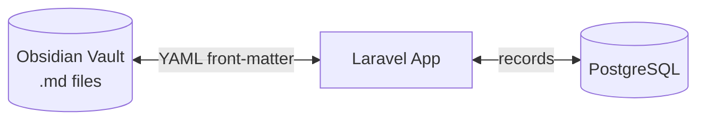

# YSLEP Service Ledger

[](https://php.net)
[](https://laravel.com)
[](https://tailwindcss.com)
[](https://vitejs.dev)
[](LICENSE)
[](https://postgresql.org)
[](https://obsidian.md)

A Laravel-based service hour tracking and reporting application that syncs with an Obsidian vault. Manage service records across three index types (Formation, Social Apostolate, Parish Involvement) with live inline editing, saved report snapshots, and academic-year archiving.



## Documentation

| Section | File |
|---|---|
| Features and screenshots | [docs/overview.md](docs/overview.md) |
| Architecture, models, and data flow | [docs/architecture.md](docs/architecture.md) |
| Installation and configuration | [docs/installation.md](docs/installation.md) |
| Usage guide and routes | [docs/usage.md](docs/usage.md) |
| Testing, code style, and contributing | [docs/development.md](docs/development.md) |

## Quick Start

```bash
composer install
cp .env.example .env
php artisan key:generate
npm install && npm run build
composer run setup
composer run dev
```

See [docs/installation.md](docs/installation.md) for detailed setup instructions.

## License

The YSLEP Service Ledger is open-sourced software licensed under the [MIT license](LICENSE).
