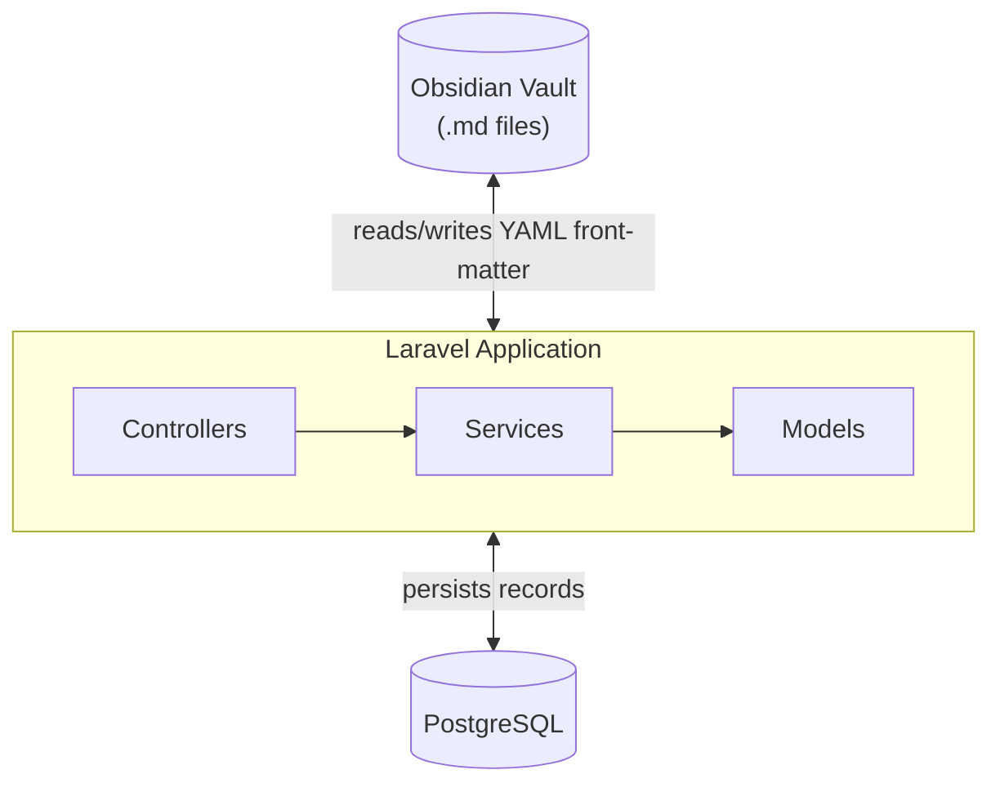

# Architecture

## Data Flow

1. **Live entries** are stored in PostgreSQL and backed by Markdown notes in an Obsidian vault
2. The web UI reads from PostgreSQL and writes back to both the database and the Markdown source files
3. **Saved reports** group a subset of live entries under a unique tag, with their own set of record notes
4. **Academic-year snapshots** capture a point-in-time view of all entries for archival purposes

---

## Models

| Model | Purpose |
|---|---|
| `FormationEntry` | Formation service records (cycle, module, title, time) |
| `SocialApostolateEntry` | Social apostolate records (activity, time) |
| `ParishInvolvementEntry` | Parish involvement records (time) |
| `ReportGroup` | A named, tagged saved report snapshot |
| `ReportGroupItem` | A record attached to a saved report |
| `AcademicYearSnapshot` | An archived academic year snapshot |
| `AcademicYearSnapshotItem` | A record attached to a snapshot |

---

## Enums

| Enum | Values |
|---|---|
| `IndexType` | `formation`, `parish_involvement`, `social_apostolate` |
| `IndexScope` | `all`, `unsaved`, `report` |

---

## Controllers

| Controller | Responsibility |
|---|---|
| `DashboardController` | Aggregates stats across all index types |
| `IndexPageController` | Per-type index viewing with scope filtering |
| `ObsidianSyncController` | CRUD for live entries (writes to DB and Markdown) |
| `ReportGroupController` | Saved report CRUD |
| `ReportGroupItemController` | Per-report record CRUD |
| `ReportObsidianSyncController` | Pulls vault edits into report records |
| `AcademicYearSnapshotController` | Academic year snapshot CRUD |

---

## Services

| Service | Responsibility |
|---|---|
| `ObsidianSyncService` | Parses YAML front-matter, syncs between Markdown and DB |
| `ReportGroupService` | Coordinates saved report creation with vault mirroring |
| `ReportGroupVaultSyncService` | Reconciles vault edits for report records |
| `AcademicYearSnapshotService` | Manages snapshot creation and archival |
